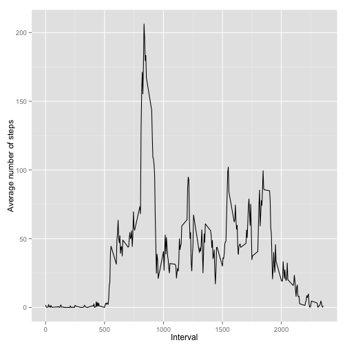
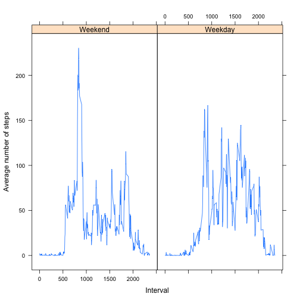

# Reproducible Research: Peer Assessment 1


## Loading and preprocessing the data
Let's read the zipped csv file and omit rows without steps.

```r
data <- read.csv(unz("activity.zip", "activity.csv"))
completeRows <- na.omit(data)
```


## What is mean total number of steps taken per day?

First, let's group by date:

```r
stepsPerDay <- aggregate(completeRows$steps, by = list(completeRows$date), FUN = sum)
```

Histogram of total number of steps taken per day looks like this:

```r
hist(stepsPerDay$x, breaks = nrow(stepsPerDay), main = "Histogram of total number of steps per day", 
    xlab = "Steps per day")
```

 

Then, let's calculate the mean and median:

```r
meanStepsPerDay = mean(stepsPerDay$x)
medianStepsPerDay = median(stepsPerDay$x)
```


Mean total number of steps taken per day is 1.0766 &times; 10<sup>4</sup>.
Median total number of steps taken per day is 10765.

## What is the average daily activity pattern?

First, let's group by interval:

```r
averageStepsPerInterval <- aggregate(completeRows$steps, by = list(completeRows$interval), 
    FUN = mean)
```

Then we can draw a time series plot:

```r
require(ggplot2)
```

```
## Loading required package: ggplot2
```

```r
ggplot(data = averageStepsPerInterval, aes(Group.1, x)) + geom_line() + xlab("Interval") + 
    ylab("Average number of steps")
```

 

Then let's fetch maximum number of steps:

```r
maxAverageStepsPerInterval <- averageStepsPerInterval[which.max(averageStepsPerInterval$x), 
    ]
```


On average, maximum number of steps per interval is 206.1698, which is on interval 835.


## Imputing missing values

Number of rows with missing values is the difference between all rows and complete rows:

```r
numberOfRowsWithMissingValues <- nrow(data) - nrow(completeRows)
```


Number of rows with missing values is 2304.

Let's create a new data frame with NAs replaced with mean steps for the given five minute interval:

```r
naRows <- data[is.na(data$steps), ]
replacedRows <- NULL
for (rowIndex in 1:nrow(naRows)) {
    interval <- naRows[[rowIndex, 3]]
    replacedSteps <- averageStepsPerInterval[averageStepsPerInterval$Group.1 == 
        interval, ][[1, 2]]
    replacedRows <- rbind(replacedRows, data.frame(steps = replacedSteps, date = naRows[[rowIndex, 
        2]], interval = interval))
}
```


Then let's append complete rows and these new replaced rows. Also, let's group by date:

```r
missingValuesFilled <- rbind(completeRows, replacedRows)
stepsPerDayFilled <- aggregate(missingValuesFilled$steps, by = list(missingValuesFilled$date), 
    FUN = sum)
```


Histogram of the new data set looks like this:

```r
hist(stepsPerDayFilled$x, breaks = nrow(stepsPerDayFilled), main = "Histogram of total number of steps per day with filled data set", 
    xlab = "Steps per day")
```

 

Like before, let's calculate mean and median of from filled data:

```r
meanStepsPerDayFilled = mean(stepsPerDayFilled$x)
medianStepsPerDayFilled = median(stepsPerDayFilled$x)
```


And the mean and median values are 1.0766 &times; 10<sup>4</sup> and 1.0766 &times; 10<sup>4</sup>.

So, if we did not make any mistakes, filling the steps modifies the median to be the same as mean.

## Are there differences in activity patterns between weekdays and weekends?

Let's split data by interval and weekday/weekend:

```r
isWeekend <- (weekdays(as.Date(missingValuesFilled$date)) %in% c("Saturday", 
    "Sunday"))
stepsPerInterval <- aggregate(missingValuesFilled$steps, by = list(missingValuesFilled$interval, 
    isWeekend), FUN = mean)
```


Now we can plot both groups:

```r
require("lattice")
```

```
## Loading required package: lattice
```

```r
factor <- factor(stepsPerInterval$Group.2, labels = c("Weekend", "Weekday"))
xyplot(stepsPerInterval$x ~ stepsPerInterval$Group.1 | factor, type = "l", xlab = "Interval", 
    ylab = "Average number of steps")
```

 

